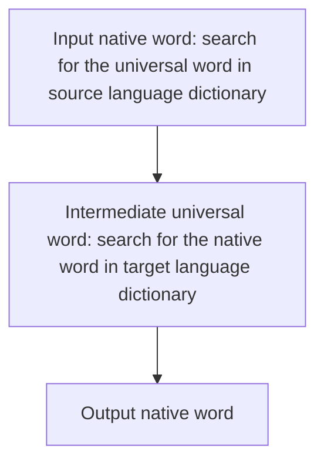

The data structure of each language dictionary is uniformly composed of pairs, each consisting of a universal word and its corresponding native word.

<table>
    <tr>
    	<th>Universal word</th>
        <td>Similar to the object-oriented usage, generally expressed in English.</td>
    </tr>
    <tr>
    	<th>Native word</th>
        <td>Native word of the language associated with the lang dict.</td>
    </tr>
</table>

## Conversion search principle



> [class:Exception\<LangDictSearchError>](https://github.com/leoweyr/Python-OOPMultilang/blob/main/doc/API%20reference.md#LangDictSearchError) will be thrown when the search process goes error.

## Support data format

The following are the supported file types for storing language dictionary data: 

| File type | State |
| --------- | ----- |
| lang      | done  |
| json      | to do |
| ...       | ...   |

### .lang

Commonly found in language pack files of Microsoft software.

The characteristic of this file type is that each line is an independent key-value pair-like, as the key and value are connected by an equal sign, and `#` is the comment symbol.

For example: 

```lang
UI.login = user login # It is a button, and this is a comment.
UI.register = user register
```

